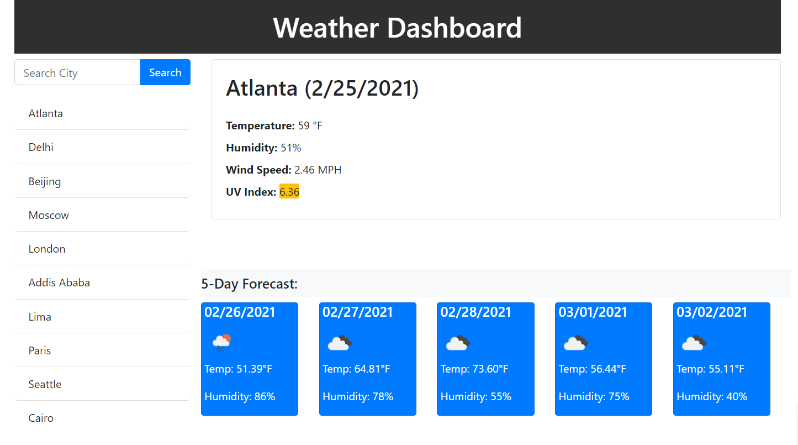

# Selma's HW6 Weather Dashboard

## Description:

In this activity, I am building a weather dashboard that displays the current weather for a city as well as forecasts the city's weather for the next five days. The code utilizes ajax calls to a weather API to grab information based off the city name. Once a user inputs a city name, they will have be able to see the temperature (converted from kelvin to farenheit), wind speed, UV, and humidity. Additionally, every city you search will be stored in localStorage and retained after a browser refresh. The UV will display colors based off the UV warning levels low(green), moderate(yellow), and severe(red).

## Installation:

- If you need to pull my code for this homework, please visit my Github repository at: https://github.com/selma-e/hw6_weather_dashboard
- If you want to see the final webpage for my code, please visit my hosted website at: https://selma-e.github.io/hw2_bootstrap_responsive_portfolio/

## Usage:

## Resources Used/Credits:

- Bootstrap https://getbootstrap.com/docs/4.0/getting-started/introduction/
- OpenWeather API https://openweathermap.org/api
- Moment JS https://momentjs.com/
- localStorage https://developer.mozilla.org/en-US/docs/Web/API/Window/localStorage

© 2021 Selma Elgabalawy | UW-SEA-FSF-PT-08-2020-U-C-TTh
